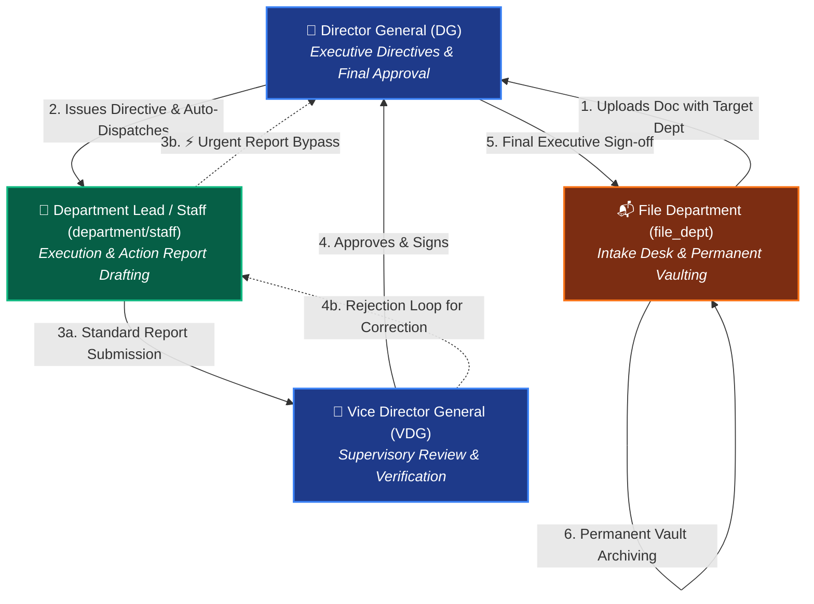
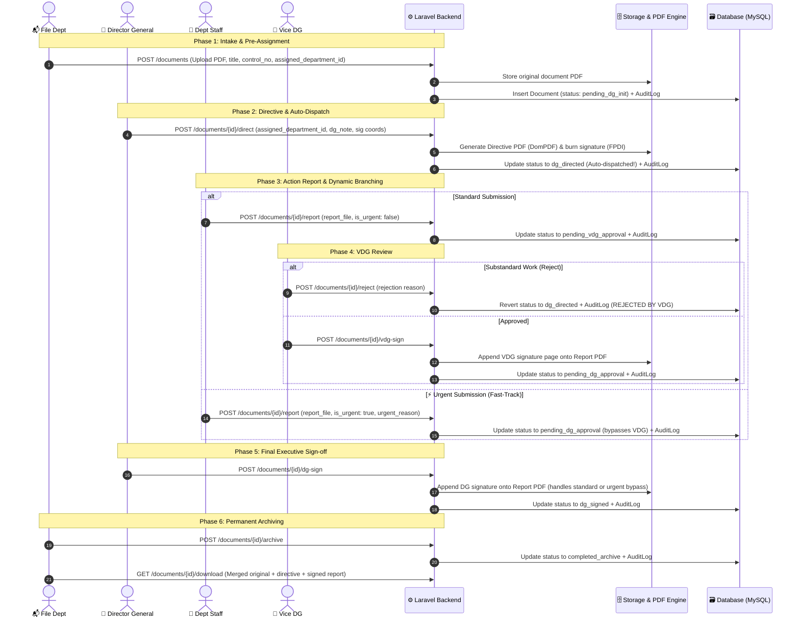
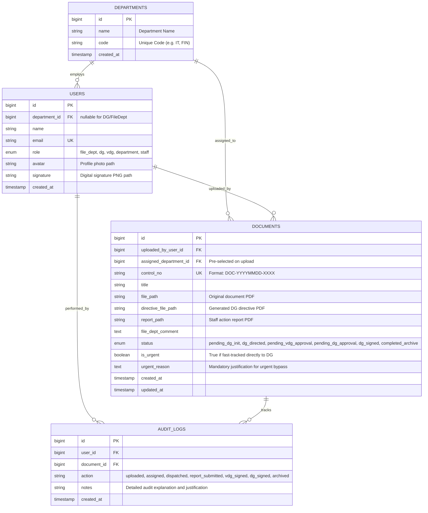

# 🏛️ BBU Digital Document Workflow & Tracking System (Doc-API)
> **Academic Project — BBU University Sarona Final Assignment**  
> *A Secure, Role-Based Governmental Document Routing, Approval, and Digital Signing Platform.*

---

## 📌 1. Project Overview & Problem Statement

### 🎯 Objective
In traditional administrative governance, paper documents suffer from:
- ⏳ **Slow physical dispatch and administrative routing bottlenecks**
- 🔍 **Lack of real-time transparency** into who currently holds a pending file
- ⚠️ **High risk of lost, duplicated, or tampered physical documents**
- ❌ **No auditable log** of when executive decisions and signatures were executed

**Doc-API** provides an automated, **Streamlined State Machine** reflecting modern governance workflows:
1. **Intake & Suggested Routing:** File Desk registers the document and pre-selects the responsible department.
2. **Executive Directive & Auto-Dispatch:** The Director General endorses the directive and digitally signs; the system **automatically dispatches** the file directly to the assigned department inbox (eliminating manual dispatch bottlenecks).
3. **Execution & Dynamic Branching:** The department completes the task and submits an Action Report with two options:
   - **Standard Flow:** Routes to the Vice Director General (VDG) for review.
   - **⚡ Urgent Fast-Track:** Bypasses VDG supervisory review directly to the Director General (DG) with mandatory audit justification.
4. **Permanent Archiving:** Final executive sign-off and consolidation into an immutable records vault.

---

## 🏛️ 2. Organizational Hierarchy & Role Matrix



### Role Permissions Matrix

| Role | Intake & Pre-assign Dept | Endorse & Auto-Dispatch | Submit Standard Report | Submit ⚡ Urgent Bypass | VDG Review & Sign | Rejection Gate | DG Final Sign | Permanent Vault Archive |
| :--- | :---: | :---: | :---: | :---: | :---: | :---: | :---: | :---: |
| `file_dept` | ✅ | ❌ | ❌ | ❌ | ❌ | ❌ | ❌ | ✅ |
| `dg` | ❌ | ✅ | ❌ | ❌ | ❌ | ❌ | ✅ | ❌ |
| `department` / `staff` | ❌ | ❌ | ✅ | ✅ | ❌ | ❌ | ❌ | ❌ |
| `vdg` | ❌ | ❌ | ❌ | ❌ | ✅ | ✅ | ❌ | ❌ |

---

## 🔄 3. End-to-End Workflow & State Machine

```mermaid
stateDiagram-v2
    [*] --> pending_dg_init: 1. File Dept uploads document with Target Dept pre-assigned
    
    pending_dg_init --> dg_directed: 2. DG signs directive & system AUTO-DISPATCHES directly to Dept Inbox
    
    state Execution_And_Branching {
        dg_directed --> pending_vdg_approval: 3a. Staff uploads Report (Standard Mode)
        dg_directed --> pending_dg_approval: 3b. Staff uploads Report (⚡ Urgent Bypass Mode with Reason)
    }

    state VDG_Supervisory_Review {
        pending_vdg_approval --> dg_directed: ⚠️ Rejection: VDG sends back to Staff for revisions
        pending_vdg_approval --> pending_dg_approval: 4. VDG signs & stamps verification annex
    }
    
    pending_dg_approval --> dg_signed: 5. DG validates executive sign-off (handles both standard & urgent)
    
    dg_signed --> completed_archive: 6. File Dept merges all PDF assets into permanent immutable vault
    
    completed_archive --> [*]: Lifecycle Closed & Audited
```

---

## ⚡ 4. Detailed Sequence Flow Diagram



---

## 🗄️ 5. Database Schema & Entity Relationship Diagram (ERD)



---

## 🚀 6. API Reference Catalog

### 🔐 Authentication & Profile
| Method | URI | Access | Description |
| :--- | :--- | :--- | :--- |
| `POST` | `/api/login` | Public | Authenticates user & returns Sanctum Bearer token |
| `POST` | `/api/logout` | Authenticated | Revokes current session token |
| `GET` | `/api/users` | Authenticated | List all registered users |
| `POST` | `/api/users/{id}/signature` | Authenticated | Upload digital signature PNG for automated document stamping |
| `POST` | `/api/users/{id}/avatar` | Authenticated | Upload user avatar |

---

### 📄 Document Operations Pipeline
| Phase | Method | URI | Permitted Roles | Description |
| :---: | :--- | :--- | :--- | :--- |
| **Phase 1** | `POST` | `/api/documents` | `file_dept` | Ingest initial document (PDF + title + `assigned_department_id`) |
| **Phase 2** | `POST` | `/api/documents/{id}/direct` | `dg` | Endorse directive & **auto-dispatch** directly to `dg_directed` |
| **Phase 3** | `POST` | `/api/documents/{id}/report` | `department`, `staff` | Upload action report (Option A: to VDG, or Option B: ⚡ Urgent to DG) |
| **Phase 4** | `POST` | `/api/documents/{id}/vdg-sign` | `vdg` | Review and apply VDG signature to action report |
| **Fail-Safe**| `POST` | `/api/documents/{id}/reject` | `vdg` | Reject report back to department staff with feedback notes |
| **Phase 5** | `POST` | `/api/documents/{id}/dg-sign` | `dg` | Final executive approval (handles standard and urgent bypass) |
| **Phase 6** | `POST` | `/api/documents/{id}/archive` | `file_dept` | Lock lifecycle into permanent immutable archive |

---

### 📊 Visibility Feeds, Search & File Streaming
| Method | URI | Permitted Roles | Description |
| :--- | :--- | :--- | :--- |
| `GET` | `/api/documents/urgent` | All Authenticated | Dynamic actionable feed (prioritizes `is_urgent` items for DG/VDG) |
| `GET` | `/api/departments/inbox` | `dept`, `staff`, `vdg` | Department-specific active processing queue |
| `GET` | `/api/documents/archive` | All Authenticated | Global (DG/FileDept) or departmental search across archived records |
| `GET` | `/api/documents/{id}` | Role Authorized | Complete document profile, metadata, and chronological audit trail |
| `GET` | `/api/documents/{id}/download` | Role Authorized | Dynamic merged multi-part archival PDF stream |
| `GET` | `/api/documents/{id}/report/download` | Role Authorized | Streams staff action report file |
| `GET` | `/api/documents/{id}/directive/download` | Role Authorized | Streams generated DG directive sheet |

---

## 💻 7. Tech Stack & Engineering Highlights

- **Framework:** Laravel 11.x (PHP 8.2+) running on Docker Sail
- **Authentication:** Laravel Sanctum (Bearer Token RBAC)
- **PDF Generation & Manipulation:**
  - `setasign/fpdi` & `setasign/fpdf`: Coordinate-based digital signature embedding directly on PDF bytes.
  - `barryvdh/laravel-dompdf`: Dynamic ministerial directive sheet and multi-signatory certificate generation.
- **Audit Traceability:** Event-driven audit logs recording timestamp, actor role, action type, and contextual notes on every status transition.

---

## 🔑 8. Pre-Configured Test Accounts & Credentials

All seeded test accounts share the same default password:
```text
password123
```

### 👑 Executive & File Desk Accounts

| Name | Role | Email | Password | Responsibilities |
| :--- | :---: | :--- | :---: | :--- |
| **Director General** | `dg` | `dg@ministry.gov` | `password123` | Executive decision maker: Issues directives, auto-dispatches files, and applies final executive sign-off. |
| **File Department Officer** | `file_dept` | `file@ministry.gov` | `password123` | Intake registry officer: Scans & uploads files with pre-assigned departments; vaults & locks finalized archives. |

---

### 🏢 Departmental Accounts (VDG Supervisors & Staff Makers)

Each ministry department has two dedicated accounts:
- **`vdg` (Vice Director General):** Department supervisor who reviews reports, approves/signs, or triggers the rejection loop.
- **`staff` (Department Staff):** Operational maker who executes directives and submits action reports (Standard or ⚡ Urgent bypass).

| Department | Dept Code | Role | Email | Password | Authority Scope |
| :--- | :---: | :---: | :--- | :---: | :--- |
| **Administration** | `ADM` | `vdg` | `vdg.adm@ministry.gov` | `password123` | VDG Supervisor for Administration |
| | | `staff` | `staff.adm@ministry.gov` | `password123` | Staff Maker for Administration |
| **Finance & Accounting** | `FIN` | `vdg` | `vdg.fin@ministry.gov` | `password123` | VDG Supervisor for Finance |
| | | `staff` | `staff.fin@ministry.gov` | `password123` | Staff Maker for Finance |
| **Human Resources** | `HR` | `vdg` | `vdg.hr@ministry.gov` | `password123` | VDG Supervisor for Human Resources |
| | | `staff` | `staff.hr@ministry.gov` | `password123` | Staff Maker for Human Resources |
| **Information & Broadcasting** | `GDIB` | `vdg` | `vdg.gdib@ministry.gov` | `password123` | VDG Supervisor for Info & Broadcasting |
| | | `staff` | `staff.gdib@ministry.gov` | `password123` | Staff Maker for Info & Broadcasting |
| **Digital Archives** | `DDA` | `vdg` | `vdg.dda@ministry.gov` | `password123` | VDG Supervisor for Digital Archives |
| | | `staff` | `staff.dda@ministry.gov` | `password123` | Staff Maker for Digital Archives |
| **Internal Audit** | `DIA` | `vdg` | `vdg.dia@ministry.gov` | `password123` | VDG Supervisor for Internal Audit |
| | | `staff` | `staff.dia@ministry.gov` | `password123` | Staff Maker for Internal Audit |
| **Personnel & Administration** | `DPA` | `vdg` | `vdg.dpa@ministry.gov` | `password123` | VDG Supervisor for Personnel |
| | | `staff` | `staff.dpa@ministry.gov` | `password123` | Staff Maker for Personnel |
| **Media Management** | `DMM` | `vdg` | `vdg.dmm@ministry.gov` | `password123` | VDG Supervisor for Media Management |
| | | `staff` | `staff.dmm@ministry.gov` | `password123` | Staff Maker for Media Management |

---

## 🚀 9. Setup & Local Execution

```bash
# 1. Clone the repository and navigate into folder
cd doc-api

# 2. Start Docker Sail environment
./vendor/bin/sail up -d

# 3. Run database migrations & seeders
./vendor/bin/sail artisan migrate:fresh --seed

# 4. Storage symlink
./vendor/bin/sail artisan storage:link
```

---
*Developed for BBU University Mobile Development & Software Engineering — Sarona Project.*
