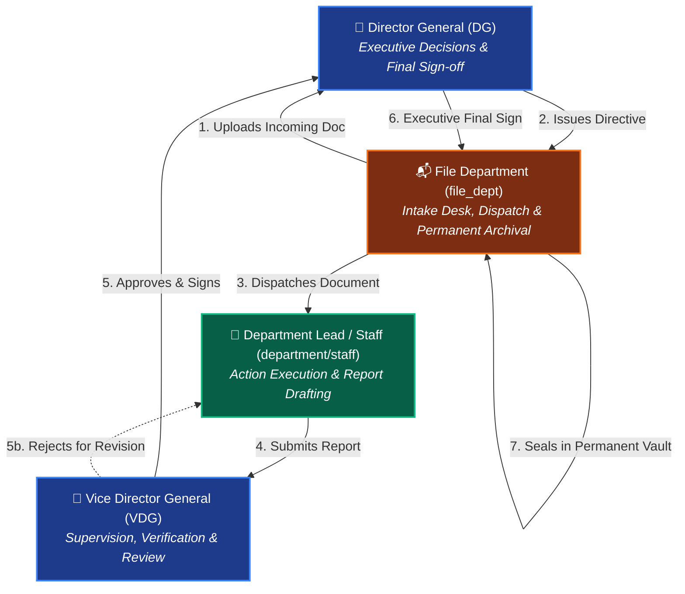
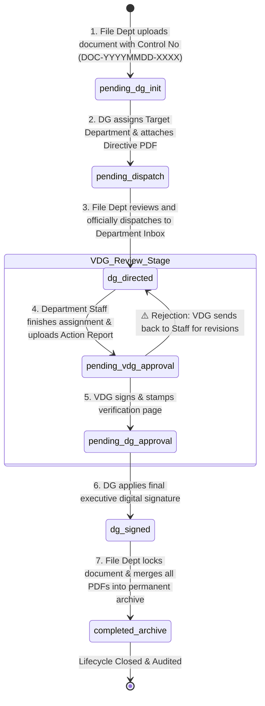
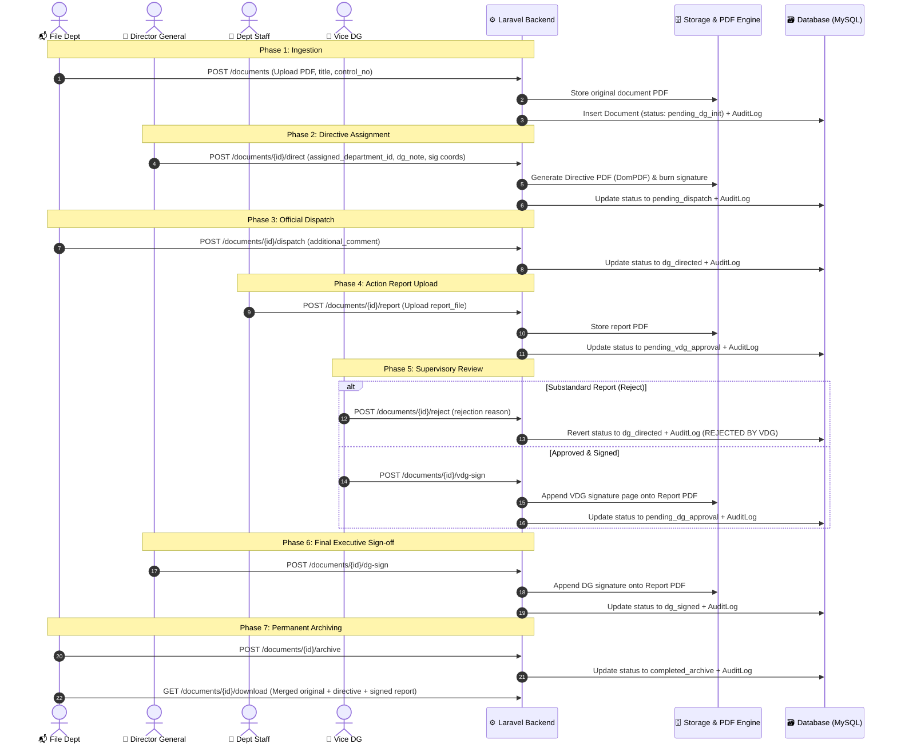
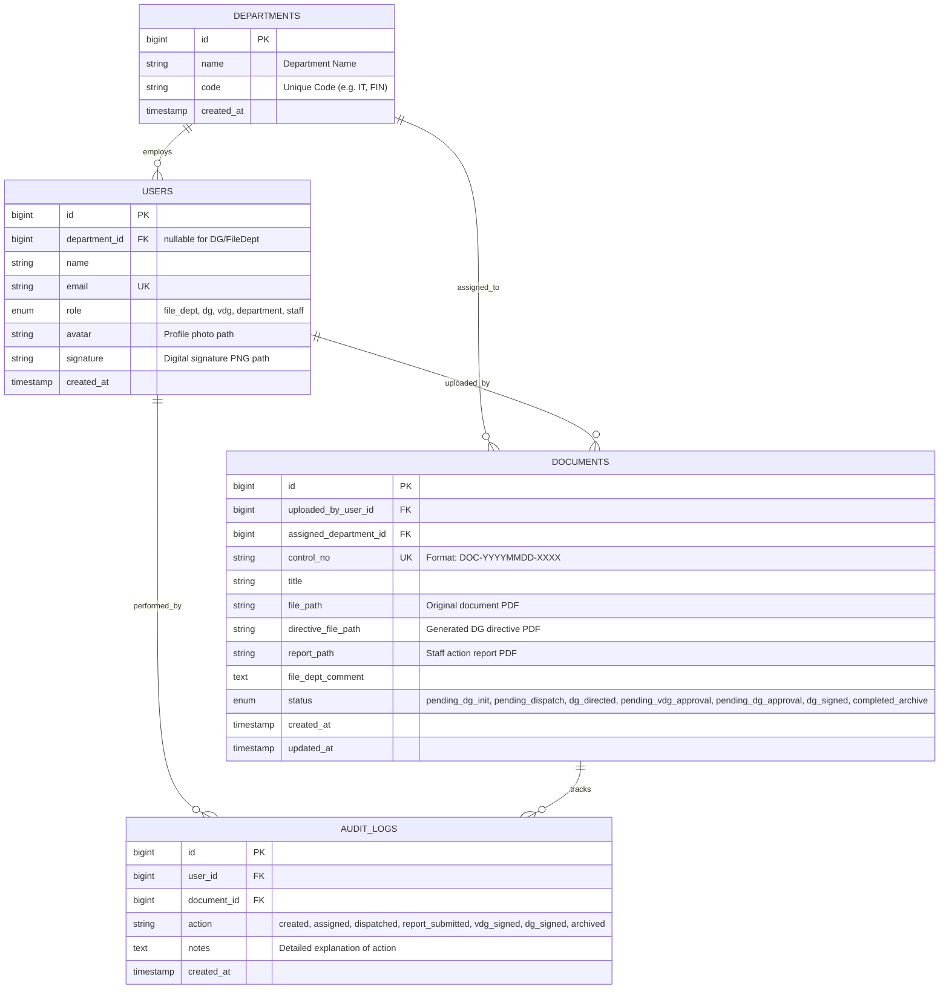

# 🏛️ CADT Digital Document Workflow & Tracking System (Doc-API)
> **Academic Project — CADT Sarona Final Assignment**  
> *A Secure, Role-Based Governmental Document Routing, Approval, and Digital Signing Platform.*

---

## 📌 1. Project Overview & Problem Statement

### 🎯 Objective
In traditional ministerial and organizational administration, paper documents suffer from:
- ⏳ **Slow physical dispatch and routing bottlenecks**
- 🔍 **Lack of real-time visibility** into who currently holds a pending document
- ⚠️ **High risk of document loss or tampering**
- ❌ **No auditable log** of when decisions and signatures were executed

**Doc-API** solves this by establishing a strict, **7-Phase State Machine** that mirrors official administrative governance workflows (File Entry Desk -> Director General -> Dispatch -> Line Departments -> Vice Director General -> Final Executive Sign-off -> Vault Archiving).

### 🛠️ Core Capabilities
- **Strict Role-Based Access Control (RBAC):** Multi-tiered hierarchy (`file_dept`, `dg`, `vdg`, `department`, `staff`).
- **Dynamic PDF Digital Stamping & Watermarking:** Merges signatures, directive sheets, and action reports via FPDI & DomPDF.
- **Bi-Directional Rejection & Correction Pipeline:** Allows supervisors to reject substandard reports back to staff.
- **Immutable Audit Logging:** Every transition is recorded with actor ID, timestamp, and notes.
- **Omni-Channel Client Ready:** Tailored for Flutter Mobile frontend and web administrative portals.

---

## 🏛️ 2. Organizational Hierarchy & Role Matrix



### Role Permissions Matrix

| Role | Upload New Doc | Assign Department | Dispatch | Submit Action Report | VDG Review & Sign | DG Final Sign | Rejection Gate | Permanent Archive |
| :--- | :---: | :---: | :---: | :---: | :---: | :---: | :---: | :---: |
| `file_dept` | ✅ | ❌ | ✅ | ❌ | ❌ | ❌ | ❌ | ✅ |
| `dg` | ❌ | ✅ | ❌ | ❌ | ❌ | ✅ | ❌ | ❌ |
| `department` / `staff` | ❌ | ❌ | ❌ | ✅ | ❌ | ❌ | ❌ | ❌ |
| `vdg` | ❌ | ❌ | ❌ | ❌ | ✅ | ❌ | ✅ | ❌ |

---

## 🔄 3. End-to-End Workflow & State Machine



---

## ⚡ 4. Detailed Sequence Flow Diagram



---

## 🗄️ 5. Database Schema & Entity Relationship Diagram (ERD)



---

## 🚀 6. API Reference Catalog

### 🔐 Authentication & Profile
| Method | URI | Access | Description |
| :--- | :--- | :--- | :--- |
| `POST` | `/api/login` | Public | Authenticates user & returns Sanctum Bearer token |
| `POST` | `/api/logout` | Authenticated | Revokes current session token |
| `GET` | `/api/users` | Authenticated | List all registered users |
| `POST` | `/api/users/{id}/signature` | Authenticated | Upload digital signature PNG for automated document stamping |
| `POST` | `/api/users/{id}/avatar` | Authenticated | Upload user avatar |

---

### 📄 Document Operations Pipeline
| Phase | Method | URI | Permitted Roles | Description |
| :---: | :--- | :--- | :--- | :--- |
| **Phase 1** | `POST` | `/api/documents` | `file_dept` | Ingest initial document (multipart PDF + title + metadata) |
| **Phase 2** | `POST` | `/api/documents/{id}/direct` | `dg` | Assign department, generate Directive PDF, and burn DG stamp |
| **Phase 3** | `POST` | `/api/documents/{id}/dispatch` | `file_dept` | Validate directive & officially route doc to line department |
| **Phase 4** | `POST` | `/api/documents/{id}/report` | `department`, `staff` | Upload completed task action report PDF |
| **Phase 5** | `POST` | `/api/documents/{id}/vdg-sign` | `vdg` | Review and apply VDG signature to action report |
| **Fail-Safe**| `POST` | `/api/documents/{id}/reject` | `vdg` | Reject report back to department with feedback notes |
| **Phase 6** | `POST` | `/api/documents/{id}/dg-sign` | `dg` | Final executive approval and signature endorsement |
| **Phase 7** | `POST` | `/api/documents/{id}/archive` | `file_dept` | Lock lifecycle into permanent immutable archive |

---

### 📊 Visibility Feeds, Search & File Streaming
| Method | URI | Permitted Roles | Description |
| :--- | :--- | :--- | :--- |
| `GET` | `/api/documents/urgent` | All Authenticated | Documents awaiting urgent action based on current user role |
| `GET` | `/api/departments/inbox` | `dept`, `staff`, `vdg` | Department-specific actionable incoming queue |
| `GET` | `/api/documents/archive` | All Authenticated | Global (DG/FileDept) or departmental search across archived records |
| `GET` | `/api/documents/{id}` | Role Authorized | Complete document profile, metadata, and chronological audit trail |
| `GET` | `/api/documents/{id}/download` | Role Authorized | Dynamic merged multi-part archival PDF stream |
| `GET` | `/api/documents/{id}/report/download` | Role Authorized | Streams staff action report file |
| `GET` | `/api/documents/{id}/directive/download` | Role Authorized | Streams generated DG directive sheet |

---

## 💻 7. Tech Stack & Engineering Highlights

```
┌────────────────────────────────────────────────────────┐
│                   FRONTEND CLIENTS                     │
│  Flutter Mobile App (iOS / Android)  │  React Admin UI │
└───────────────────────────┬────────────────────────────┘
                            │ RESTful JSON / HTTPS
┌───────────────────────────▼────────────────────────────┐
│                    LARAVEL 11 BACKEND                  │
│  • Sanctum Token RBAC Middleware                       │
│  • 7-Phase State Machine Controller Engine            │
│  • Event-Sourced Audit Logging Subsystem               │
└───────────────────────────┬────────────────────────────┘
                            │
              ┌─────────────┴─────────────┐
              ▼                           ▼
┌───────────────────────────┐ ┌───────────────────────────┐
│     DATABASE STORAGE      │ │     PDF ENGINE & MERGER   │
│  MySQL / PostgreSQL       │ │  • FPDI Coordinate Burner │
│  • Foreign Key Integrity  │ │  • DomPDF Template Engine │
│  • Indexed Control Nos    │ │  • Dynamic Multi-Doc Join │
└───────────────────────────┘ └───────────────────────────┘
```

- **Framework:** Laravel 11.x (PHP 8.2+)
- **Authentication:** Laravel Sanctum (Bearer Token RBAC)
- **PDF Generation & Manipulation:**
  - `setasign/fpdi` & `setasign/fpdf`: Coordinate-based digital signature embedding directly on PDF bytes.
  - `barryvdh/laravel-dompdf`: Dynamic ministerial directive sheet and multi-signatory certificate generation.
- **Audit Traceability:** Event-driven audit logs recording timestamp, actor role, action type, and contextual notes on every status transition.

---

## 🎓 8. Quick Presentation Pitch for Your Teacher

When presenting this project to your professor / supervisor, you can emphasize the following key points:

1. **Academic & Real-World Value:**  
   *"This project digitizes bureaucratic document workflows, replacing physical paper transit with a secure, 7-phase state machine that mirrors real governmental hierarchies (File Registry -> Director General -> Department Staff -> Vice DG -> Archive)."*
2. **Key Technical Innovations:**  
   - **Custom State Machine Pattern:** Strict route-level and database-level validation preventing illegal status jumps.
   - **Automated Digital Signature & PDF Assembly:** Real-time PDF modification with coordinate signature burning and automated multi-document merging.
   - **Complete Audit Trail:** Strict accountability with immutable logs for every single action.
   - **Supervisor Rejection Loop:** Realistic workflow incorporating feedback and revisions before executive sign-off.
3. **Cross-Platform Readiness:**  
   *"The backend exposes clean, stateless RESTful endpoints consumed by Flutter mobile and web interfaces."*

---

## 🚀 Setup & Local Execution

### Prerequisites
- PHP 8.2+ with `gd`, `fileinfo`, `pdo_mysql` extensions
- Composer 2+
- MySQL or PostgreSQL database

### Installation Steps
```bash
# 1. Clone the repository and navigate into folder
cd doc-api

# 2. Install PHP dependencies
composer install

# 3. Configure environment file
cp .env.example .env
php artisan key:generate

# 4. Run database migrations & seeders
php artisan migrate:fresh --seed

# 5. Create storage symlink for uploaded files
php artisan storage:link

# 6. Start the development server
php artisan serve --port=8000
```

---
*Developed for CADT Mobile Development & Software Engineering — Sarona Project.*
